# Spotspotter

Aplikacja dla fanów fotografii motoryzacyjnej (i nie tylko), która pozwala na udostepnianie lokalizacji (spotów) do robienia zdjęć.


DEMO: [https://spotspotter.azurewebsites.net/login](https://spotspotter.azurewebsites.net/login)

# Diagram architektury


# Technologie

Do stworzenia aplikacji serwerowej wykorzystany został framework `NestJS`. 
Aplikacja frontendowa używa natomiast biblioteki `React`. Próba zabawy z frameworkiem `NextJS` zakończyły się niestety niepowodzeniem. 
W przypadku obu elementów jako główny język używany jest Typescript.

Aplikacja deployowana jest na chmurę Microsoft Azure przy pomocy Github Actions. 

# Struktura katalogów repozytorium

```bash
├── azure/ # zrzuty ekranu z konfiguracji Azure
├── preview/ # zrzuty ekranu z aplikacji
├── client/ # kod zawierający część kliencką aplikacji
│   ├── public/ # pliki statyczne (np. favicon, index.html)
│   ├── package.json # zależności części klienckiej
│   ├── src/ # folder z plikami źródłowymi części klienckiej
│   │   ├── api/ # pliki dotyczące naszego połączenia z API serwerowym
│   │   ├── azure/ # pliki konfiguracyjne Azure 
│   │   ├── containers/ # kontenery aplikacji trzymające stan
│   │   ├── components/ # komponenty
│   │   ├── layouts/ # layouty aplikacji pozwalające na łatwe dodawanie nowych stron
│   │   ├── pages/ # ekrany/podstrony aplikacji
│   │   ├── styles/ # globalne style aplikacji
│   │   ├── types/ # typy wykorzystane w aplikacji
│   │   └── App.tsx # punkt startowy aplikacji
│   │
│   └── # dodatkowe pliki konfiguracyjne React, Typescript
│
├── src/ # kod zawierający część serwerową aplikacji
│   ├── location/ # moduł dotyczący lokalizacji
│   └── main.ts # moduł główny aplikacji serwerowej
│
├── README.md # krótka dokumentacja projektu
├── package.json # zależności części serwerowej
└── .github/workflows # pliki dot. pipeline'u

```

# Interfejs aplikacji

## Strona logowania

Strona, na której możemy zobaczyć logo aplikacji oraz zalogować się do niej za pomocą konta Microsoft (Azure AD).
Logo aplikacji dostarczone jest za pomocą `Azure Blob Storage`.


## Strona główna (lista lokalizacji)

Na stronie głównej możemy zobaczyć dwa główne elementy aplikacji - mapa będąca tłem oraz interfejsem do zarządzania lokalizacjami oraz modal z listą zapisanych wcześniej lokalizacji. Na tym ekranie dostajemy podstawowe informacje o lokalizacji, takie jak nazwa i adres. 

``` TBA: Dodatkowo możemy zobaczyć liczbę zdjęć, które zostały dodane do danej lokalizacji. ```

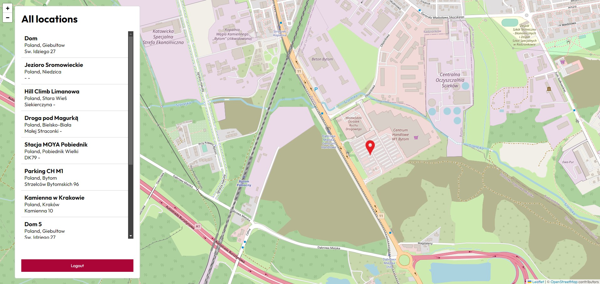

### Strona pojedynczej lokalizacji

Strona pojedynczej lokalizacji przedstawia dokładny adres wraz z opisem danego miejsca, oprócz tego możemy zobaczyć lokalizację na mapie. 
``` TBA: Możemy też zobaczyć zdjęcia dodane do danej lokalizacji. ```

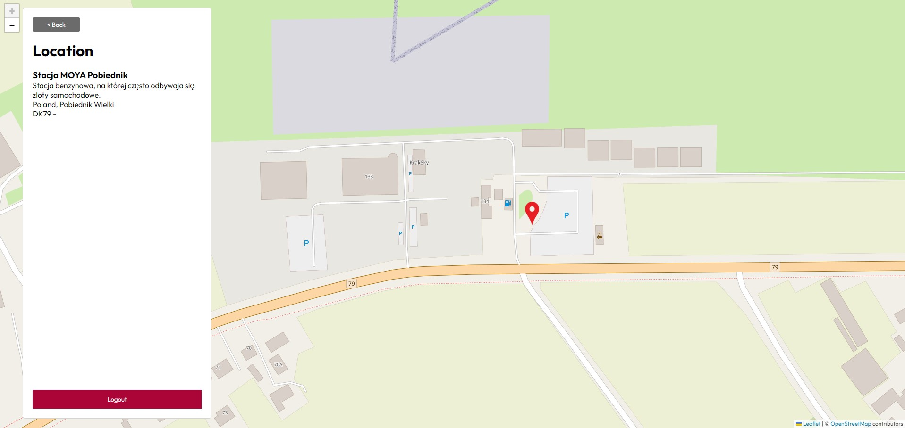


### Strona tworzenia nowej lokalizacji

Klikając w jakieś miejsce na mapie otwieramy stronę tworzenia nowej lokalizacji.
Możemy tam podać nazwę, opis oraz adres. Dokłade koordynaty są przesyłane przez samą mapę. 

``` TBA: Dodatkowo możemy dodać zdjęcia do danej lokalizacji. ```

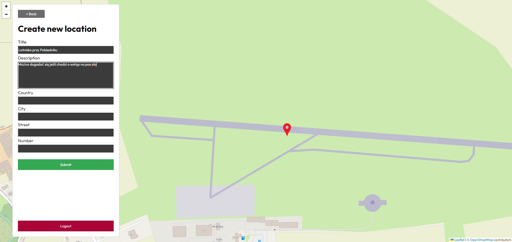

# Funkcjonalności Azure

Na rzecz projektu utworzyłem specjalną grupę zasobów o nazwie `spotspotter-resources`. W niej umieszczone zostały wykorzystane komponenty:

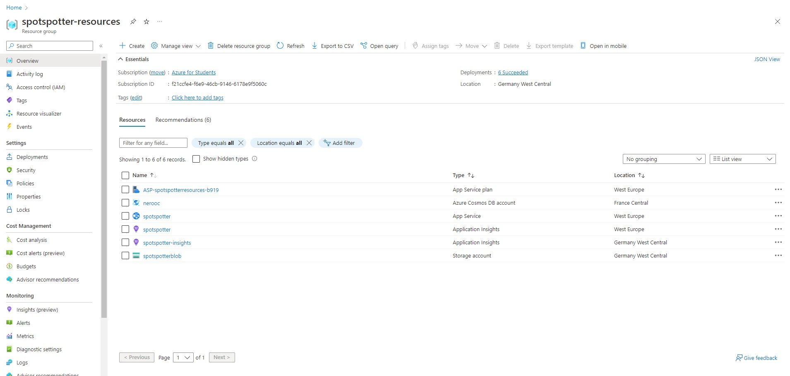

Na wykorzystane komponenty w projekcie składa się:
- App Service (w tym deployment sloty na staging i production)
- Azure Cosmos DB
- Storage account (Blob Storage)
- Monitoring:
  - Application Insights
  - Metryki
  - Alerty

Jedyny komponent, który został umieszczony w ramach innej grupy zasobów oraz w ramach innej subskrypcji to Active Directory. Spowodowane jest to ograniczeniami nałożonymi przez organizację, w której znajduje się AGH'owe konto Azure:
- Active Directory

## App Service

Po nierównej walce przeprowadzonej z frameworkiem NextJS, powróciłem do czystego Reacta. Oczywiście do hostowania aplikacji wykorzystałem usługę `App Service`. W tym celu utworzyłem dwa deployment sloty - `staging` oraz `production`. Deploy aplikacji odbywa się automatycznie za pomocą GitHub Actions. Pliki yml dotyczące pipeline'u znajdują się w folderze `.github/workflows`.

Wszystkie zmiany w kodzie aplikacji są wdrażane na slot `staging`, a dopiero po jego przetestowaniu mogą po manualnym deployu trafić na `production`.

Node'owa aplikacja stworzona za pomocą frameworka NestJS serwuje statyczne pliki zbudowane przez Reacta. 

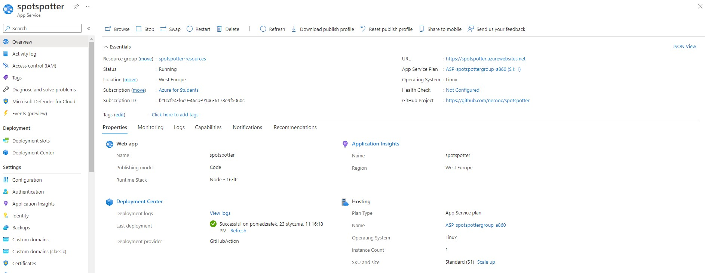

## Azure Cosmos DB

W bazie danych NoSQL Azure Cosmos DB przechowywane są dane o lokalizacjach. Składa się ona z jednego kontenera o nazwie `locations`. W nim znajdziemy wszystkie dokumenty dotyczące lokalizacji zapisane w bazie.

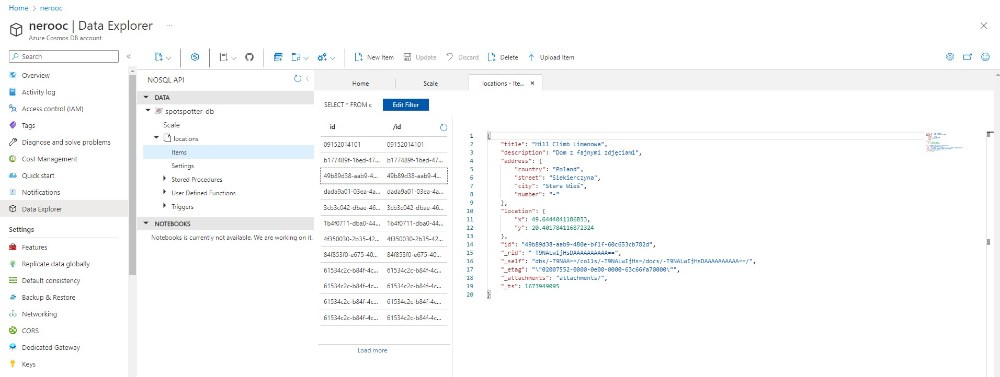


## SQL Blob Storage

Do przechowywania zdjęć wykorzystałem usługę `Blob Storage`. Na ten moment utworzyłem kontener o nazwie `public`. 
W nim znajdują się podstawowe zdjęcia używane w aplikacji. W późniejszej fazie rozwoju prawdopodobnie dodam więcej kontenerów.

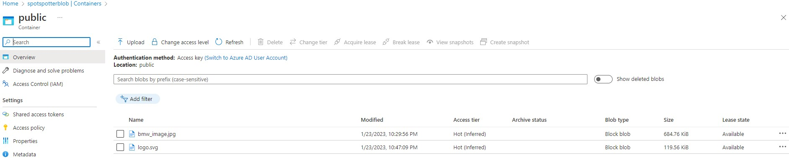


## Autoryzacja w aplikacji

Do autoryzacji w aplikacji wykorzystałem usługę `Active Directory`, ze specjalną konfiguracją przeznaczoną dla aplikacji typu SPA (np. React/Next.js).

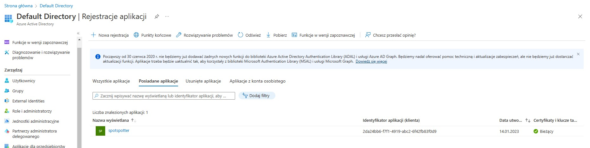


## Monitoring

W ramach monitoringu wykorzystałem kilka funkcjonalności oferowanych przez Azure:

### Application Insights

Application Insights jest usługą, która zbiera informacje o działaniu aplikacji. W tym przypadku zbiera ona informacje o wyjątkach, które mogą wystąpić w aplikacji. Funkcjonalność ta jest aktualnie podpięta do aplikacji i przedstawia nam dane.

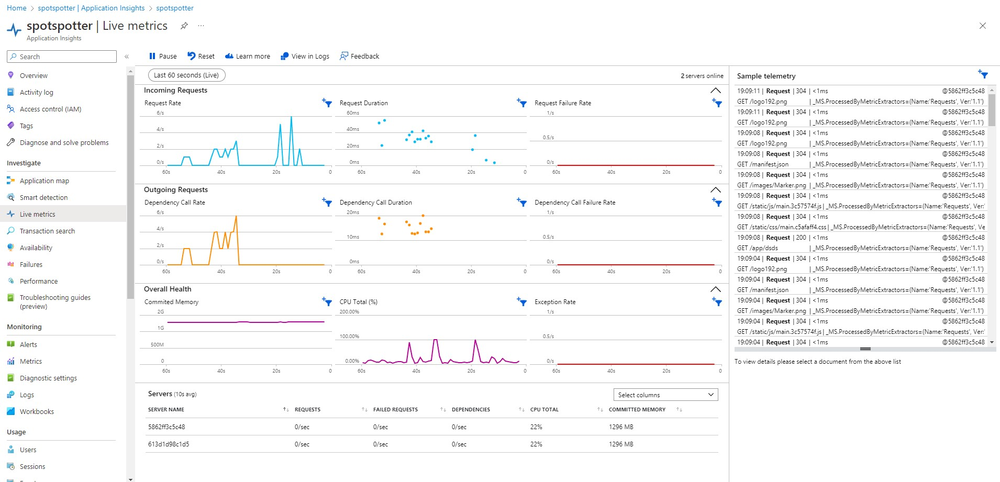


### Metryki

W ramach metryk wykorzystałem usługę `Metrics`, która zbiera informacje o wydajności aplikacji.

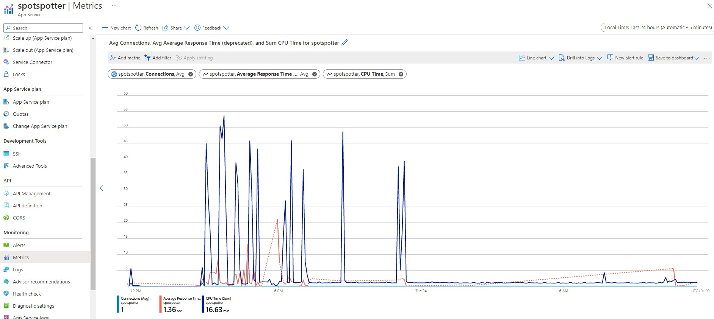


### Alerty

W ramach alertów wykorzystałem usługę `Alerts`, która pozwala na automatyczne wysyłanie maili w przypadku wystąpienia błędu w aplikacji. Stworzyłem dwie reguły:
 - failed-server-requests - wysyła maila w przypadku wystąpienia większej liczby (> 5) nieudanych żądań do aplikacji,
 - response-time-alert - wysyła alert w przypadku wystąpienia większej liczby żądań, które zajęły więcej niż 3 sekundy.

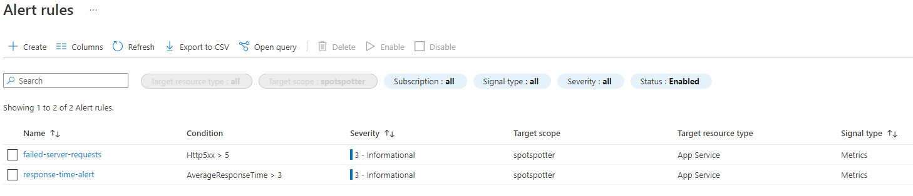