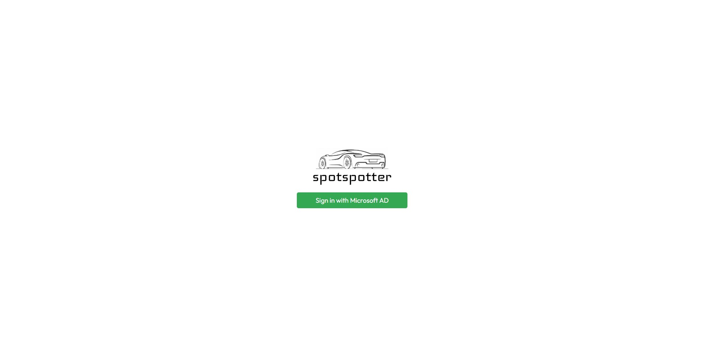

# Spotspotter

Aplikacja dla fanów fotografii motoryzacyjnej (i nie tylko), która pozwala na udostepnianie lokalizacji (spotów) do robienia zdjęć.

DEMO: [https://spotspotter.azurewebsites.net/](https://spotspotter.azurewebsites.net/)

# Technologie

Do stworzenia aplikacji serwerowej wykorzystany został framework `NestJS`. 
Aplikacja frontendowa używa natomiast frameworka `NextJS`. W przypadku obu elementów jako główny język używany jest Typescript.

Aplikacja deployowana jest na chmurę Microsoft Azure przy pomocy Github Actions. 

# Struktura katalogóww repozytorium

```bash
├── azure/ # zrzuty ekranu z konfiguracji Azure
├── preview/ # zrzuty ekranu z aplikacji
├── client/ # kod zawierający część kliencką aplikacji
│   ├── public/ # pliki statyczne (np. favicon, index.html)
│   ├── package.json # zależności części klienckiej
│   ├── src/ # folder z plikami źródłowymi części klienckiej
│   │   ├── api/ # pliki dotyczące naszego połączenia z API serwerowym
│   │   ├── azure/ # pliki konfiguracyjne Azure 
│   │   ├── containers/ # kontenery aplikacji trzymające stan
│   │   ├── components/ # komponenty
│   │   ├── layouts/ # layouty aplikacji pozwalające na łatwe dodawanie nowych stron
│   │   ├── pages/ # ekrany/podstrony aplikacji
│   │   ├── styles/ # globalne style aplikacji
│   │   └── types/ # typy wykorzystane w aplikacji 
│   │
│   └── # dodatkowe pliki konfiguracyjne NextJS, Typescript, eslint, babel
│
├── src/ # kod zawierający część serwerową aplikacji
│   ├── location/ # moduł dotyczący lokalizacji
│   └── main.ts # moduł główny aplikacji serwerowej
│
├── README.md # krótka dokumentacja projektu
└── package.json # zależności części serwerowej
```

# Interfejs aplikacji

## Strona logowania

Strona, na której możemy zobaczyć logo aplikacji oraz zalogować się do niej za pomocą konta Microsoft (Azure AD).



## Strona główna (lista lokalizacji)

Na stronie głównej możemy zobaczyć dwa główne elementy aplikacji - mapa będąca tłem oraz interfejsem do zarządzania lokalizacjami oraz modal z listą zapisanych wcześniej lokalizacji. Na tym ekranie dostajemy podstawowe informacje o lokalizacji, takie jak nazwa i adres. 

``` TBA: Dodatkowo możemy zobaczyć liczbę zdjęć, które zostały dodane do danej lokalizacji. ```


### Strona pojedynczej lokalizacji

Strona pojedynczej lokalizacji przedstawia dokładny adres wraz z opisem danego miejsca, oprócz tego możemy zobaczyć lokalizację na mapie. 
``` TBA: Możemy też zobaczyć zdjęcia dodane do danej lokalizacji. ```


### Strona tworzenia nowej lokalizacji

Klikając w jakieś miejsce na mapie otwieramy stronę tworzenia nowej lokalizacji.
Możemy tam podać nazwę, opis oraz adres. Dokłade koordynaty są przesyłane przez samą mapę. 

``` TBA: Dodatkowo możemy dodać zdjęcia do danej lokalizacji. ```


# Funkcjonalności Azure

Na rzecz projektu utworzyłem specjalną grupę zasobów o nazwie `spotspotter-resources`. W niej umieszczone zostały wykorzystane komponenty:


Na wykorzystane komponenty w projekcie składa się:
- App Service
- Application Insights
- Azure Cosmos DB
- Storage account (Blob Storage)

Jedyny komponent, który został umieszczony w ramach innej grupy zasobów oraz w ramach innej subskrypcji to Active Directory. Spowodowane jest to ograniczeniami nałożonymi przez organizację, w której znajduje się AGH'owe konto Azure:
- Active Directory

## Azure Cosmos DB

W bazie danych NoSQL Azure Cosmos DB przechowywane są dane o lokalizacjach. Składa się ona z jednego kontenera o nazwie `locations`. W nim znajdziemy wszystkie dokumenty dotyczące lokalizacji zapisane w bazie.


## Autoryzacja w aplikacji

Do autoryzacji w aplikacji wykorzystałem usługę `Active Directory`, ze specjalną konfiguracją przeznaczoną dla aplikacji typu SPA (np. React/Next.js).


